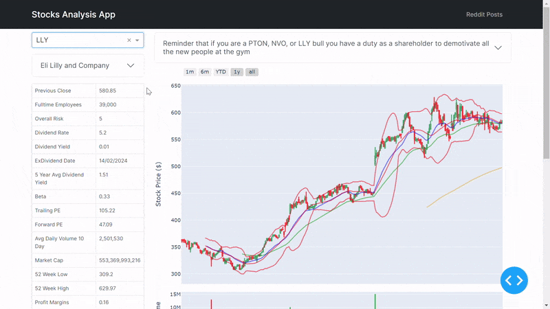
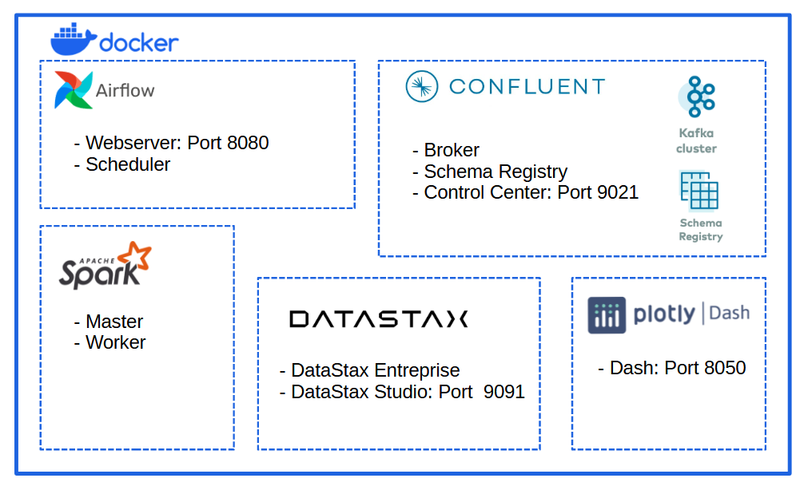
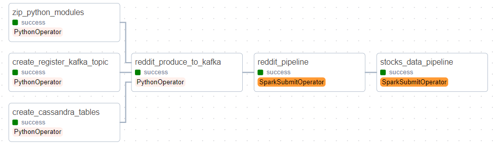

# Stocks Analysis Project

## Table of Contents
- [Project Description](#project-description)
- [Project Components](#project-components)
    - [Docker Services](#docker-services)
    - [Pipelines](#pipelines)
    - [Libraries Used](#libraries-used)
- [Getting Started](#getting-started)
    - [Prerequisites](#prerequisites)
    - [Usage](#usage)

## Project Description

The Stocks Analysis Project aims to create a Dash Dashboard with financial information for stocks and ETFs.

The first part of the project focuses on creating a Reddit Posts Dashboard with the posts found within the *wallstreetbets* subreddit. The dashboard includes:
- List of stocks and ETFs mentioned in the Reddit posts.
- List of posts with their sentiment analysis.
- Summary of the company along with financial information.
- An interactive candlestick graph with indicators.



## Project Components



### Docker Services

The project uses Docker to containerize various services:

- **Apache Airflow:** Orchestrates the tasks.
- **Apache Kafka:** Reddit posts are produced to a Kafka topic.
- **Apache Spark:** Processes the data.
- **Cassandra DataStax Enterprise:** Stores the data.
- **Dash:** Displays the Dashboard.

There are two docker-compose files in */docker* folder.
- **docker-compose.yml:** Apache Airflow runs with *LocalExecutor*. It is a Lightweight version to consume less resources in development mode.
- **docker-compose-full-airflow.yml:** Apache Airflow runs with *CeleryExecutor*. The complete version of Apache Airflow.

### Pipelines



The following tasks are defined in an Apache Airflow DAG:

1. **zip_python_modules:** Zips modules for transfer to the Spark Master.
2. **create_register_kafka_topic:** Creates a Kafka topic and registers the schema in the Confluent Schema Registry.
3. **create_cassandra_tables:** Creates the Cassandra keyspace and tables in DataStax Entreprise.
4. **reddit_produce_to_kafka:** Produces Reddit posts messages to the Kafka broker.
5. **reddit_pipeline:** Spark pipeline that reads posts from Kafka, extracts stock symbols, performs sentiment analysis with a Hugging Face pipeline, and saves the data to Cassandra.
6. **stocks_data_pipeline:** Spark pipeline that extracts symbols from Cassandra, retrieves information and price history from Yahoo Finance, calculates indicators, and saves the data to Cassandra.

### Libraries Used

- apache-airflow
- prawl
- pandas
- confluent-kafka
- pyspark
- cassandra-driver
- transformers
- yfinance
- pandas-ta
- dash

## Getting Started

### Prerequisites

- Install [Docker](https://docs.docker.com/engine/install/) and [docker-compose](https://docs.docker.com/compose/install/).
- Get a [Reddit Secret Key and Client Id](https://www.reddit.com/prefs/apps).
- Get an [Alpha Vantage API Key](https://www.alphavantage.co/support/#api-key).

### Usage

1. Clone this project to your computer.
2. Insert your Reddit Secret Key and Client Id and Alpha Vantage API Key in *stocks_analysis/stocks_etl/utils/config.py*
3. Open the terminal and navigate to the *stocks_analysis\docker*.
4. Choose the appropriate docker-compose file.
5. Run one of the following commands to build the images and install the containers:
    ```bash
    /docker> docker-compose up -d --build
    ```
    ```bash
    /docker> docker-compose -f docker-compose-full-airflow.yml up -d --build
    ```
6. Open Apache Airflow Webserver at [http://localhost:8080/](http://localhost:8080/).
7. Log in to Apache Airflow with:
    - **Username:** airflow
    - **Password:** airflow
8. Go to Admin -> Connections and add a Spark connection with the following options:
    - **Connection Id:** spark_default
    - **Connection Type:** Spark
    - **Host:** spark://spark-master
    - **Port:** 7077

9. Run the DAG.
10. After completion, open the Dash Dashboard at [http://localhost:8050/](http://localhost:8050/).